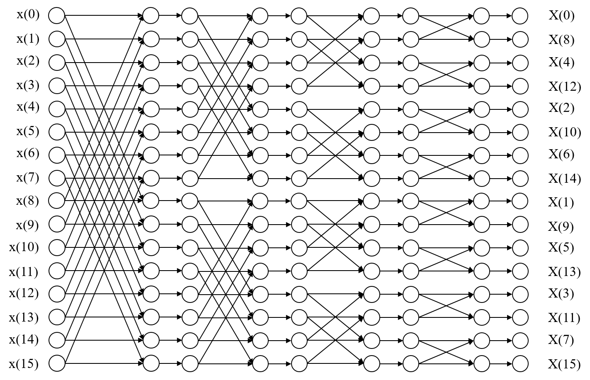
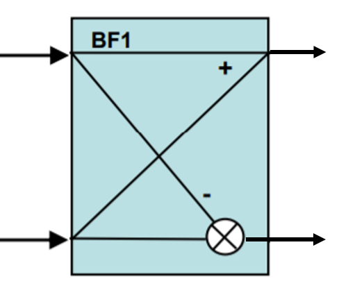
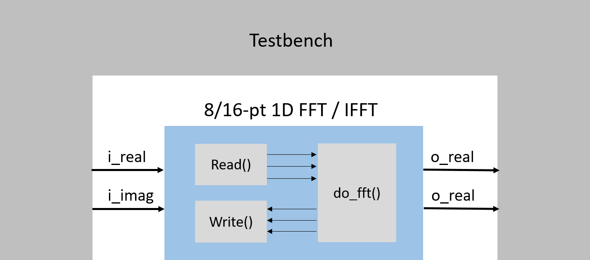

# Final Project - 1D Fast Fourier Transform (1D FFT)

In the final project, I'm going to implement a 16-pt FFT module with a multi-core riscv-vp platform.  
In this project, I implemented the FFT core module on both single core platform and multi-core platform to compare the performance between w/ and w/o parallelism. In addition, to get the exact simulated time of the FFT core, a HLS FFT module is also implemented.

## The algorithm of DIF FFT

FFT is an algorithm that computes the discrete Fourier transform (DFT) of a sequence, or its inverse (IDFT). Fourier analysis converts a signal from its original domain (usually time or space) to a representation in the frequency domain and vice versa.

The formula for the DFT is: 

=%5Csum_%7Bn=0%7D%5E%7BN-1%7Dx%5Cleft%20(%20n%20%5Cright%20)W_%7Bnk%7D%5E%7BN%7D,%200%5Cleq%20k%5Cleq%20N-1%5C)

where the twiddle factor (TF)

)

The DFT thus has the time complexity of N^2, where the N is the number of inputs, which Hence is inefficient for hardware.

Thus, the FFT was proposed for the purpose of making it efficient and more hardware suitable. The decimation-in-frequency (DIF) FFT algorithm is: 

=X\left&space;(&space;2m&space;\right&space;)&plus;X\left&space;(&space;2m&plus;1&space;\right&space;))

&plus;x\left&space;(&space;n&plus;\frac{N}{2}&space;\right&space;)&space;\right&space;]W_{N/2}^{mn}&plus;\sum_{n=0}^{N/2-1}\left&space;(&space;\left&space;[&space;x\left&space;(&space;n&space;\right&space;)-x\left&space;(&space;n&plus;\frac{N}{2}&space;\right&space;)&space;\right&space;]W_{N/2}^{mn}&space;\right&space;)W_{N}^{n})

which devides the output terms into even and odd. By doing so on and on for each stage, finally it has the time somplexity of Nlog2(N), which significantly decreasse the latency.

The relative architecture design for 16-pt DIF FFT which has 4 stages is shown in the figure below.

  

Each cross in the figure above is the basic computation unit of this architecture, which is called "Butterfly." Each butterfly has 2 complex inputs and 2 complex outputs, which involves in a multiplication with TFs and 2 additions. The block diagram of it is shown below.

  

The order of inputs in this DIF FFT algorithm is in order. Nevertheless, the ouputs are in bit-reversed order. Thus, we'll need a re-order module to get the outputs in order.

## System Architecture

###  RISC-V VP Platform for Dual-core System

The system architecture is similar to the one in HW4, which uses the TLM transaction and a simpleBus to transfer the data in between as shown in the figure below. In addition, a direct memory access (DMA) module is involved to provide a faster data transfer.

To make it run parallelly, the 16-pt inputs are splited into two 8-pt inputs for both real and imaginary parts. In addition, the 16-pts DIF FFT is replaced with two 8-pt DIF FFT.

### HLS Platform

The fft kernal is implemented as a arithmatic block on the HLS platform to get a more accurate simulated time. The system architecture is shown below.

  

## Implementations

-	The core computation "Butterfly unit", defined as a function "butterfly", can be found in oneD_FFT.cpp as the codes below. In addition, to prevent from the enormous need of hardware resource, the entire module is based on 16-bits fixed point datatype. Hence, every single variable involves in the computation is carefully defined. 

		void butterfly
		    ( const sc_int<16>& w_real  ,
		      const sc_int<16>& w_imag  , 
		      const sc_int<16>& real1_in,
		      const sc_int<16>& imag1_in,
		      const sc_int<16>& real2_in,
		      const sc_int<16>& imag2_in,
		      sc_int<16>& real1_out,
		      sc_int<16>& imag1_out,
		      sc_int<16>& real2_out,
		      sc_int<16>& imag2_out
		    )
		{

			// Variable declarations
		     sc_int<17> tmp_real1;
		     sc_int<17> tmp_imag1;
		     sc_int<17> tmp_real2;
		     sc_int<17> tmp_imag2;
		     sc_int<34> tmp_real3;
		     sc_int<34> tmp_imag3;
		  
		    // Begin Computation (fixed-point)
		    // <s,6,10> = <s,5,10> + <s,5,10>
		    tmp_real1 = real1_in + real2_in; 
		    tmp_imag1 = imag1_in + imag2_in;
		    tmp_real2 = real1_in - real2_in;
		    tmp_imag2 = imag1_in - imag2_in;
		    //   <s,13,20> = <s,6,10>*<s,5,10> - <s,6,10>*<s,5,10>
		    tmp_real3 = tmp_real2*w_real - tmp_imag2*w_imag;
		    //   <s,13,20> = <s,6,10>*<s,5,10> - <s,6,10>*<s,5,10>
		    tmp_imag3 = tmp_real2*w_imag + tmp_imag2*w_real; 
		    // assign the sign-bit(MSB)      
		    real1_out[15] = tmp_real1[16];
		    imag1_out[15] = tmp_imag1[16];
		    // assign the rest of the bits
		    real1_out.range(14,0) = tmp_real1.range(14,0);
		    imag1_out.range(14,0) = tmp_imag1.range(14,0);
		   	// assign the sign-bit(MSB)      
		    real2_out[15] = tmp_real3[33];
		    imag2_out[15] = tmp_imag3[33];          
		   	// assign the rest of the bits
		    real2_out.range(14,0) = tmp_real3.range(24,10);
		    imag2_out.range(14,0) = tmp_imag3.range(24,10);

		}

-	As for the twiddle factor in the calculation of FFT, a recursive method is used here as shown below: 

	    // <'s'/'u',m,n>: is used in comments to denote a fixed point representation
	    // 's'- signed, 'u'- unsigned, m - no. of integer bits, n - no. of fractional bits
	    //  N = 16
	    //  theta = 8.0*atan(1.0)/N; theta = 22.5 degree

       	//  w_real =  cos(theta) = 0.92 (000000.1110101110) <s,5,10>
            w_real =  942;

       	//  w_imag = -sin(theta) = -0.38(111111.1001111010) <s,5,10>
            w_imag = -389;

       	//  w_rec_real = 1(0000001.0000000000)
	   	    w_rec_real = 1024;

       	//  w_rec_real = 0(000000.0000000000)	 
            w_rec_imag = 0;

	    unsigned short w_index;
	    w_index = 0;  
	    for( w_index = 0; w_index < W; ++w_index) 
	    {
	    // <s,9,22> = <s,5,10> * <s,5,10>
	     w_temp1 = w_rec_real*w_real;
	     w_temp2 = w_rec_imag*w_imag;

	    // <s,9,22> = <s,5,10> * <s,5,10>
	     w_temp3 = w_rec_real*w_imag;
	     w_temp4 = w_rec_imag*w_real;  

	    // <s,10,22> = <s,9,22> - <s,9,22>
	     w_temp5 = w_temp1 - w_temp2;

	    // <s,10,22> = <s,9,22> + <s,9,22>
	     w_temp6 = w_temp3 + w_temp4;
	     
	    // assign the sign-bit(MSB)
	     W_real[w_index][15] = w_temp5[32];
	     W_imag[w_index][15] = w_temp6[32];

	    // assign the rest of the bits
	     W_real[w_index].range(14,0) = w_temp5.range(24,10);
	     W_imag[w_index].range(14,0) = w_temp6.range(24,10);

	    // update w_rec.. values for the next iteration
	     w_rec_real = W_real[w_index];
	     w_rec_imag = W_imag[w_index];
	    }

-	However, in the DIF FFT architecture, the order of outputs are bit-reversed. Thus, we have to bit-reverse the indexes for each output.   

	    for (int n = 0; n < N; ++n) // N = 16-pt
	      {
	       	bits_i = n;
	       	bits_index[3]= bits_i[0];
	       	bits_index[2]= bits_i[1];
	       	bits_index[1]= bits_i[2];
	       	bits_index[0]= bits_i[3];
	       	index = bits_index;
	       	real1 = real[index];
	       	imag1 = imag[index];
		#ifndef NATIVE_SYSTEMC
		{
		   	HLS_DEFINE_PROTOCOL("output");
		   	o_real.put(real1); 
       		o_imag.put(imag1);
		}
		#else
		   	o_real.write(real1); 
       		o_imag.write(imag1);
		#endif
		  }

## How to execute the codes

### HLS simulation

-	First of all, go to the stratus directory.

		$ cd $Final/hls/stratus

-	Run behavioral simulation.

		$ make sim_B

-	Run synthesis and Verilog simulation with HLS configuration BASIC.

		$ make sim_V_BASIC

-	Run synthesis and Verilog simulation with HLS configuration DPA.

		$ make sim_V_DPA

### RISC-V VP

-	Build the platforms of RISC-V VP.

		$ cd Final/riscv-vp/vp
		$ mkdir build
		$ cd build
		$ cmake ..
		$ make install

-	Go to one of the following working directory.

		$ cd Final/riscv-vp/vp/sw/singlecore
		$ cd Final/riscv-vp/vp/sw/multicore

-	Compile and Run simulaitons.

		$ make
		$ make sim

## Results

-	The 16-pt inputs lie in the files `in_real.h` and `in_imag.h` are shown below.
		
		int input_r [16] = {
			1,0,0,0,0,0,0,0,0,0,0,0,0,0,0,0};

		int input_i [16] = {
			2021,2021,2021,2021,2021,2021,2021,2021,
			2021,2021,2021,2021,2021,2021,2021,2021};

-	The outputs I got are as follows which are as expected.

		out_real = 1, out_imag = 32336
		out_real = 1, out_imag = 0
		out_real = 1, out_imag = 0
		out_real = 1, out_imag = 0
		out_real = 1, out_imag = 0
		out_real = 1, out_imag = 0
		out_real = 1, out_imag = 0
		out_real = 1, out_imag = 0
		out_real = 1, out_imag = 0
		out_real = 1, out_imag = 0
		out_real = 1, out_imag = 0
		out_real = 1, out_imag = 0
		out_real = 1, out_imag = 0
		out_real = 1, out_imag = 0
		out_real = 1, out_imag = 0
		out_real = 1, out_imag = 0

-	The simulated results are as follows:

	-	The HLS behavioral simulation.

			    SystemC 2.3.1-Accellera --- Feb 14 2019 12:08:38
	        Copyright (c) 1996-2014 by all Contributors,
	        ALL RIGHTS RESERVED
			NOTE: Cadence Design Systems Hub Simulation Platform : version 19.12-s100

			Info: /OSCI/SystemC: Simulation stopped by user.
			Total run time = 2621430 ns
			Simulated time == 2621490 ns

	-	The single core version.

	-	The dual-core version.

	-	To sum up:

		| Configuration | Simulated time |
		| -----------   | -------------: |
		| HLS sim_B    	|     2621430 ns |
		| Sinale core   |    43909110 ns |
		| Dual-core     |    38010870 ns |
