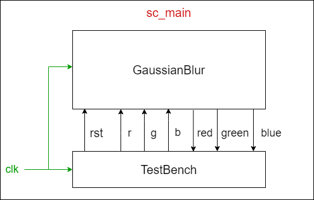

# Gaussian Blur with SystemC

We're going to perform a 3x3 Gaussian blur on an input bitmap with SystemC.   
The SystemC module contains the following three process:
- An Input process to parse image format and send pixels to next process
- A Computation process to receive pixels and do Gaussian blur. Then pass results to the next process.
- An Output process to dump processed pixels as a BMP image.

## Gaussian Blur Filter

## System Architecture

The sc_modules, `Testbench` and `GaussianBlur`, are connected with the sc_fifo channels as shown in the figure below.

  

## Implementation

The 3x3 Gaussian blur filter is calculated with the algorithm below.

    double filter[filterHeight][filterWidth] = {0,0,0,0,0,0,0,0,0};
    double sum=0.0;

    for (i=0 ; i<filterHeight ; i++) {
        for (j=0 ; j<filterWidth ; j++) {
            k = i - floor(filterHeight/2);
            l = j - floor(filterWidth/2);
            filter[i][j] = exp(-(k*k+l*l)/(2*sigma*sigma))/(2*M_PI*sigma*sigma);
            sum += filter[i][j];
        }
    }

    for (i=0 ; i<filterHeight ; i++) {
        for (j=0 ; j<filterWidth ; j++) {
            filter[i][j] /= sum;
        }
    }

`Testbench` sends the input R, G, and B via 3 different sc_fifo channels to `GaussianBlur`. After the operation of convolution, `GaussianBlur`sends back the output R, G, and B via another 3 different sc_fifo channels to `Testbench`. The declaration of the fifo channels are as follows.

In the `Testbench.h` we have:

    sc_out<bool> o_rst;
    sc_fifo_out<unsigned char> o_r;
    sc_fifo_out<unsigned char> o_g;
    sc_fifo_out<unsigned char> o_b;
    sc_fifo_in<double> i_red;
    sc_fifo_in<double> i_green;
    sc_fifo_in<double> i_blue;

And in the `GaussianBlur.h` we have:

    sc_in<bool> i_rst;
    sc_fifo_in<unsigned char> i_r;
    sc_fifo_in<unsigned char> i_g;
    sc_fifo_in<unsigned char> i_b;
    sc_fifo_out<double> o_red;
    sc_fifo_out<double> o_green;
    sc_fifo_out<double> o_blue;

In the `Testbench.cpp` and `GaussianBlur.cpp` we use read() and write() functions to fetch and send data through sc_fifo channels. For example:

    while (true) {
        red = 0;
        green = 0;
        blue = 0;
        for (unsigned int v = 0; v < filterHeight; ++v) {
            for (unsigned int u = 0; u < filterWidth; ++u) {
                red += i_r.read() * filter[v][u];
                green += i_g.read() * filter[v][u];
                blue += i_b.read() * filter[v][u];
                wait();
            }
        }
        o_red.write(red);
        o_green.write(green);
        o_blue.write(blue);
    }

## How to execute the codes

1.  Compile the program

        $ mkdir build
        $ cd build
        $ cmake ..
        $ make

2.  Run the model program

        $ make run

## Result

|Input Bitmap | Sigma = 1| Sigma = 3 | Sigma = 10
|---------------|---------------|---------------|---------------|
|
  
|
  
|
  
|
  

## Conclusion

From this HW I learnt how to use FIFO channels to transfer data between SystemC modules.
