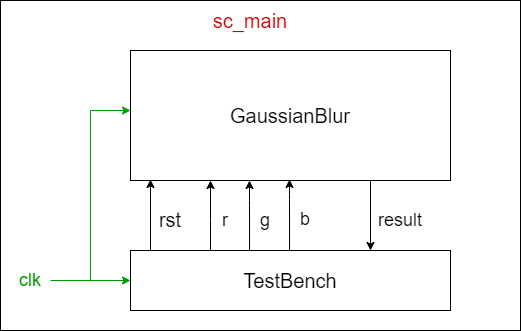

# Gaussian Blur with FIFO channels and row buffers

The goal is to implement a Gaussian blur filter with SystemC modules connected with SystemC FIFO channels. In addition, we'd like to send in batch a row or a column of image pixels from Input to Calculation.

## System Architecture

The sc_modules, `Testbench` and `GaussianBlur`, are connected with the sc_fifo channels as shown in the figure below.

  

## Implementation

`Testbench` sends the input R, G, and B via 3 different sc_fifo channels to `GaussianBlur`. After the operation of convolution, `GaussianBlur`sends back the output R, G, and B via another 3 different sc_fifo channels to `Testbench`. The declaration of the fifo channels are as follows.

In the `Testbench.h` we have:

    sc_out<bool> o_rst;
    sc_fifo_out<unsigned char> o_r;
    sc_fifo_out<unsigned char> o_g;
    sc_fifo_out<unsigned char> o_b;
    sc_fifo_in<double> i_red;
    sc_fifo_in<double> i_green;
    sc_fifo_in<double> i_blue;

And in the `GaussianBlur.h` we have:

    sc_in<bool> i_rst;
    sc_fifo_in<unsigned char> i_r;
    sc_fifo_in<unsigned char> i_g;
    sc_fifo_in<unsigned char> i_b;
    sc_fifo_out<double> o_red;
    sc_fifo_out<double> o_green;
    sc_fifo_out<double> o_blue;

In the `Testbench.cpp` and `GaussianBlur.cpp` we use read() and write() functions to fetch and send data through sc_fifo channels. For example:

    while (true) {
        red = 0;
        green = 0;
        blue = 0;
        for (unsigned int v = 0; v < filterHeight; ++v) {
            for (unsigned int u = 0; u < filterWidth; ++u) {
                red += i_r.read() * filter[v][u];
                green += i_g.read() * filter[v][u];
                blue += i_b.read() * filter[v][u];
                wait();
            }
        }
        o_red.write(red);
        o_green.write(green);
        o_blue.write(blue);
    }
    
The connections of the FIFO channels are implemented in `main.cpp` as follows:

    Testbench tb("tb");
    GaussianBlur gaussian_blur("gaussian_blur");
    sc_clock clk("clk", CLOCK_PERIOD, SC_NS);
    sc_signal<bool> rst("rst");
    sc_fifo<unsigned char> r;
    sc_fifo<unsigned char> g;
    sc_fifo<unsigned char> b;
    sc_fifo<double> red;
    sc_fifo<double> green;
    sc_fifo<double> blue;
    tb.i_clk(clk);
    tb.o_rst(rst);
    gaussian_blur.i_clk(clk);
    gaussian_blur.i_rst(rst);
    tb.o_r(r);
    tb.o_g(g);
    tb.o_b(b);
    tb.i_red(red);
    tb.i_green(green);
    tb.i_blue(blue);
    gaussian_blur.i_r(r);
    gaussian_blur.i_g(g);
    gaussian_blur.i_b(b);
    gaussian_blur.o_red(red);
    gaussian_blur.o_green(green);
    gaussian_blur.o_blue(blue);

## How to execute the codes

1.  Compile the program

        $ mkdir build
        $ cd build
        $ cmake ..
        $ make

2.  Run the model program

        $ make run

## Result

|Input Bitmap | Output Bitmap|
|---------------|---------------|
|||

## Conclusion

From this HW I learnt how to use FIFO channels to transfer data between SystemC modules.
