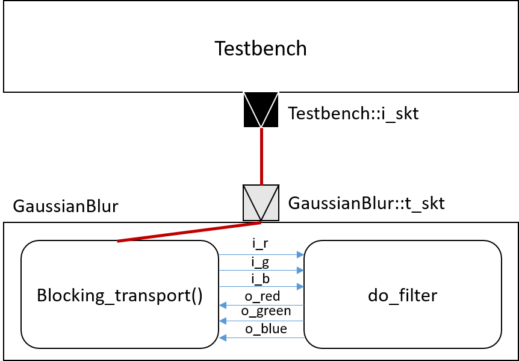

# Gaussian Blur with TLM-2.0 interfaces

In this homework we will wrap the Gaussian blur and testbench modules with TLM 2.0 sockets. And all modules will be connected through point-to-point TLM.

## System Architecture

The system architecture uses the TLM 2.0 sockets, including initiator and target sockets, to realize point-to-point connection between modules as shown in the figure below.

  

## Implementation

The TLM socket biding between the two modules `Testbench` and `GaussianBlur` is implemented as follows:

    Testbench tb("tb");
    GaussianBlur gaussian_filter("gaussian_filter");
    tb.initiator.i_skt(gaussian_filter.t_skt);

## Result

|Input Bitmap | Output Bitmap|
|---------------|---------------|
|||

## Conclusion

Based on the previous HW, the only difference is the use of TLM simplebus for data transfer. By doing so, we can better modulize each of the master and slave modules.
