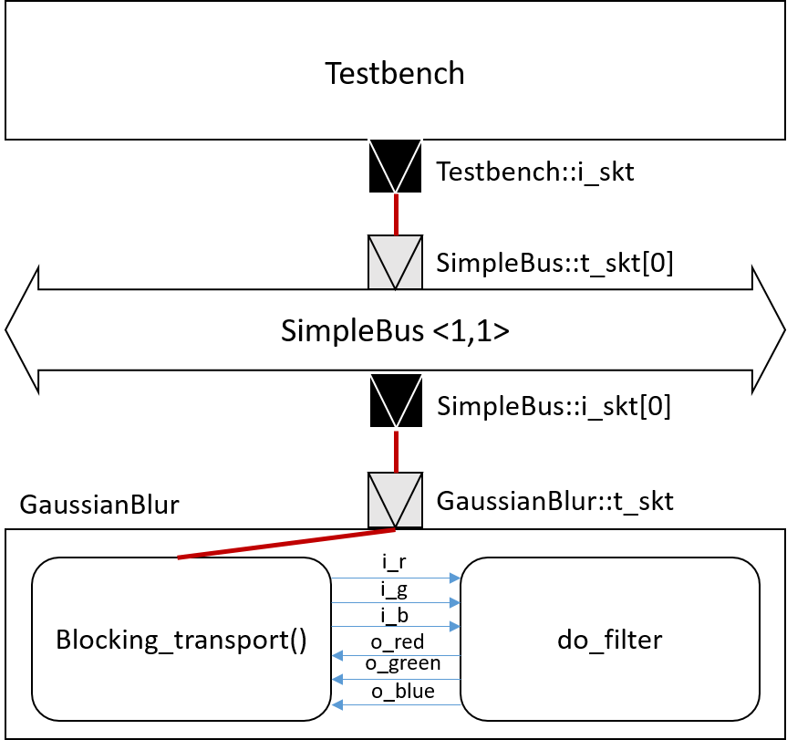

# Gaussian Blur with a TLM-2.0 interconnect

In HW 3, we have wrapped the Gaussian blur and testbench modules with TLM 2.0 sockets. In this HW we will connect the Gaussian blur and testbench modules through TLM bus.

## System Architecture

The system architecture uses the TLM transaction and a TLM simpleBus to transfer the data in between as shown in the figure below.

  

## Implementation

The TLM simplebus shown above has a master module and a slave module. The TLM socket binding is as follows:

    Testbench tb("tb");
    SimpleBus<1, 1> bus("bus");
    bus.set_clock_period(sc_time(CLOCK_PERIOD, SC_NS));
    GaussianBlur gaussian_blur("gaussian_blur");
    tb.initiator.i_skt(bus.t_skt[0]);
    bus.setDecode(0, GAUSSIAN_MM_BASE, GAUSSIAN_MM_BASE + GAUSSIAN_MM_SIZE - 1);
    bus.i_skt[0](gaussian_blur.t_skt);

## Result

|Input Bitmap | Output Bitmap|
|---------------|---------------|
|||

## Conclusion

Based on the previous HW, the only difference is the use of TLM simplebus for data transfer. By doing so, we can better modulize each of the master and slave modules.
