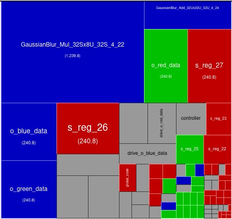
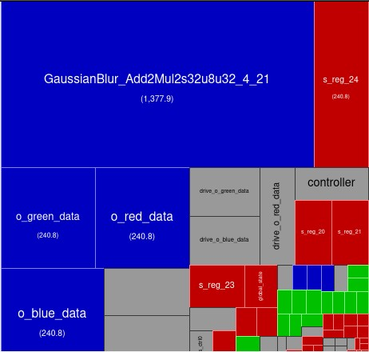

# High Level Synthesis (HLS) of Gaussian Blur

## The Goal of This HW

The goal is to synthesize the kernel function of the Gaussian blur and annotate the timing back to the platform from previous homework.

## System Architecture

The system architecture is similar as the one in HW2, as shown in the figure below.

1. 	A top-level module `System` is instantiated to contain `Testbench` and `GaussianBlur`.
2. 	Compared to HW2, the three R, G, and B channels are combined as one channel "rgb".
3. 	Instead of `sc_fifo`, the data channels are defined as the synthesizable streaming interface `cynw_p2p<>` of Stratus HLS.
4. 	The directory stratus contains the Stratus HLS project file (project.tcl) and Makefile to run Stratus HLS.

## Modifications made in codes

1.	In the system.h:

		#ifndef NATIVE_SYSTEMC
			GaussianBlur_wrapper gaussian_blur;
		#else
			GaussianBlur gaussian_blur;
		#endif
			sc_clock clk;
			sc_signal<bool> rst;
		#ifndef NATIVE_SYSTEMC
			cynw_p2p< sc_dt::sc_uint<24> > rgb;
			cynw_p2p< sc_dt::sc_uint<32> > red;
			cynw_p2p< sc_dt::sc_uint<32> > green;
			cynw_p2p< sc_dt::sc_uint<32> > blue;
		#else
			sc_fifo< sc_dt::sc_uint<24> > rgb;
			sc_fifo< sc_dt::sc_uint<32> > red;
			sc_fifo< sc_dt::sc_uint<32> > green;
			sc_fifo< sc_dt::sc_uint<32> > blue;
		#endif

2.	In the Testbench.h:

		#ifndef NATIVE_SYSTEMC
			cynw_p2p< sc_dt::sc_uint<24> >::base_out o_rgb;
			cynw_p2p< sc_dt::sc_uint<32> >::base_in i_red;
			cynw_p2p< sc_dt::sc_uint<32> >::base_in i_green;
			cynw_p2p< sc_dt::sc_uint<32> >::base_in i_blue;
		#else
			sc_fifo_out< sc_dt::sc_uint<24> > o_rgb;
			sc_fifo_in< sc_dt::sc_uint<32> > i_red;
			sc_fifo_in< sc_dt::sc_uint<32> > i_green;
			sc_fifo_in< sc_dt::sc_uint<32> > i_blue;
		#endif

3.	In the GaussianBlur.cpp:

		#ifndef NATIVE_SYSTEMC
			cynw_p2p< sc_dt::sc_uint<24> >::in i_rgb;
			cynw_p2p< sc_dt::sc_uint<32> >::out o_red;
			cynw_p2p< sc_dt::sc_uint<32> >::out o_green;
			cynw_p2p< sc_dt::sc_uint<32> >::out o_blue;
		#else
			sc_fifo_in< sc_dt::sc_uint<24> > i_rgb;
			sc_fifo_out< sc_dt::sc_uint<32> > o_red;
			sc_fifo_out< sc_dt::sc_uint<32> > o_green;
			sc_fifo_out< sc_dt::sc_uint<32> > o_blue;
		#endif

4.	In the Testbench.cpp and GaussianBlur.cpp, the read() and write() functions are replaced with get() and put() functions. For example:

		#ifndef NATIVE_SYSTEMC
			o_rgb.put(rgb);
		#else
			o_rgb.write(rgb);
		#endif
		#ifndef NATIVE_SYSTEMC
			red = i_red.get();
		    green = i_green.get();
		    blue = i_blue.get();
		#else
			red = i_red.read();
		    green = i_green.read();
		    blue = i_blue.read();
		#endif

## How to execute the codes

-	First of all, go to the stratus directory.

		$ cd $HW5/Splited/stratus

-	Run behavioral simulation.

		$ make sim_B

-	Run synthesis and Verilog simulation with HLS configuration BASIC.

		$ make sim_V_BASIC

-	Run synthesis and Verilog simulation with HLS configuration DPA.

		$ make sim_V_DPA

## Results

-	The synthesized results lies in the table below:
	| Configuration | Simulated time | Synthesized Area |
	| -----------   | -------------: | ---------------: |
	| sim_B        	|    26214450 ns |             None |
	| sim_V_BASIC   |    43909110 ns |             3984 |
	| sim_V_DPA     |    38010870 ns |             3420 |

-	The RTL analysis for BASIC configuration.

	

-	The RTL analysis for DPA configuration.

	
