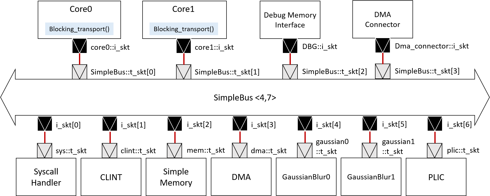

# Data Partitioning of the Gaussian Blur Processing

In this HW, we're going to add two Gaussian Blur modules to the dual-core riscv-vp platform "tiny32-mc". To achieve parallelism,the image is partitioned into equal parts and a multi-core program is written to issue the processing to the two modules.

## System Architecture

The system architecture is similar to the one in HW4, which uses the TLM transaction and a simpleBus to transfer the data in between as shown in the figure below. In addition, a direct memory access (DMA) module is involved to provide a faster data transfer.

  

To make it run parallelly, the 16-pt inputs are partitioned into two 8-pt inputs for both real and imaginary parts. In addition, the 16-pts DIF FFT is replaced with two 8-pt DIF FFT. The way to partition the input data is as follows.
	
	int length = 16;
  	int start_length = length / PROCESSORS * hart_id, end_length = length / PROCESSORS * hart_id + length / PROCESSORS;
  	for(int i = start_length; i < end_length; i++){
		.
		.
		.
	}

The TLM simplebus shown above has 4 master modules and 7 slave modules. The TLM socket binding is as follows:

	core0_mem_if.isock.bind(bus.tsocks[0]);
	core1_mem_if.isock.bind(bus.tsocks[1]);
	dbg_if.isock.bind(bus.tsocks[2]);

	PeripheralWriteConnector dma_connector("SimpleDMA-Connector");  // to respect ISS bus locking
	dma_connector.isock.bind(bus.tsocks[3]);
	dma.isock.bind(dma_connector.tsock);
	dma_connector.bus_lock = bus_lock;

	bus.isocks[0].bind(mem.tsock);
	bus.isocks[1].bind(clint.tsock);
	bus.isocks[2].bind(sys.tsock);
	bus.isocks[3].bind(dma.tsock);
	bus.isocks[4].bind(two_D_FFT0.tsock);
	bus.isocks[5].bind(two_D_FFT1.tsock);
	bus.isocks[6].bind(plic.tsock);

## Implementations

-	The core computation "Butterfly unit", defined as a function "butterfly", can be found in oneD_FFT.cpp as the codes below. In addition, to prevent from the enormous need of hardware resource, the entire module is based on 16-bits fixed point datatype. Hence, every single variable involves in the computation is carefully defined. 

		void butterfly
		    ( const sc_int<16>& w_real  ,
		      const sc_int<16>& w_imag  , 
		      const sc_int<16>& real1_in,
		      const sc_int<16>& imag1_in,
		      const sc_int<16>& real2_in,
		      const sc_int<16>& imag2_in,
		      sc_int<16>& real1_out,
		      sc_int<16>& imag1_out,
		      sc_int<16>& real2_out,
		      sc_int<16>& imag2_out
		    )
		{

		    // Variable declarations
		     sc_int<17> tmp_real1;
		     sc_int<17> tmp_imag1;
		     sc_int<17> tmp_real2;
		     sc_int<17> tmp_imag2;
		     sc_int<34> tmp_real3;
		     sc_int<34> tmp_imag3;
		  
		    // Begin Computation (fixed-point)
		    // <s,6,10> = <s,5,10> + <s,5,10>
		    tmp_real1 = real1_in + real2_in; 
		    tmp_imag1 = imag1_in + imag2_in;
		    tmp_real2 = real1_in - real2_in;
		    tmp_imag2 = imag1_in - imag2_in;
		    //   <s,13,20> = <s,6,10>*<s,5,10> - <s,6,10>*<s,5,10>
		    tmp_real3 = tmp_real2*w_real - tmp_imag2*w_imag;
		    //   <s,13,20> = <s,6,10>*<s,5,10> - <s,6,10>*<s,5,10>
		    tmp_imag3 = tmp_real2*w_imag + tmp_imag2*w_real; 
		    // assign the sign-bit(MSB)      
		    real1_out[15] = tmp_real1[16];
		    imag1_out[15] = tmp_imag1[16];
		    // assign the rest of the bits
		    real1_out.range(14,0) = tmp_real1.range(14,0);
		    imag1_out.range(14,0) = tmp_imag1.range(14,0);
		   	// assign the sign-bit(MSB)      
		    real2_out[15] = tmp_real3[33];
		    imag2_out[15] = tmp_imag3[33];          
		   	// assign the rest of the bits
		    real2_out.range(14,0) = tmp_real3.range(24,10);
		    imag2_out.range(14,0) = tmp_imag3.range(24,10);

		}

-	As for the twiddle factor in the calculation of FFT, a recursive method is used here as shown below: 

	    // <'s'/'u',m,n>: is used in comments to denote a fixed point representation
	    // 's'- signed, 'u'- unsigned, m - no. of integer bits, n - no. of fractional bits
	    //  N = 16
	    //  theta = 8.0*atan(1.0)/N; theta = 22.5 degree

       	//  w_real =  cos(theta) = 0.92 (000000.1110101110) <s,5,10>
            w_real =  942;

       	//  w_imag = -sin(theta) = -0.38(111111.1001111010) <s,5,10>
            w_imag = -389;

       	//  w_rec_real = 1(0000001.0000000000)
	   	    w_rec_real = 1024;

       	//  w_rec_real = 0(000000.0000000000)	 
            w_rec_imag = 0;

	    unsigned short w_index;
	    w_index = 0;  
	    for( w_index = 0; w_index < W; ++w_index) 
	    {
	    // <s,9,22> = <s,5,10> * <s,5,10>
	     w_temp1 = w_rec_real*w_real;
	     w_temp2 = w_rec_imag*w_imag;

	    // <s,9,22> = <s,5,10> * <s,5,10>
	     w_temp3 = w_rec_real*w_imag;
	     w_temp4 = w_rec_imag*w_real;  

	    // <s,10,22> = <s,9,22> - <s,9,22>
	     w_temp5 = w_temp1 - w_temp2;

	    // <s,10,22> = <s,9,22> + <s,9,22>
	     w_temp6 = w_temp3 + w_temp4;
	     
	    // assign the sign-bit(MSB)
	     W_real[w_index][15] = w_temp5[32];
	     W_imag[w_index][15] = w_temp6[32];

	    // assign the rest of the bits
	     W_real[w_index].range(14,0) = w_temp5.range(24,10);
	     W_imag[w_index].range(14,0) = w_temp6.range(24,10);

	    // update w_rec.. values for the next iteration
	     w_rec_real = W_real[w_index];
	     w_rec_imag = W_imag[w_index];
	    }

-	However, in the DIF FFT architecture, the order of outputs are bit-reversed. Thus, we have to bit-reverse the indexes for each output.   

	    for (int n = 0; n < N; ++n) // N = 16-pt
	      {
	       	bits_i = n;
	       	bits_index[3]= bits_i[0];
	       	bits_index[2]= bits_i[1];
	       	bits_index[1]= bits_i[2];
	       	bits_index[0]= bits_i[3];
	       	index = bits_index;
	       	real1 = real[index];
	       	imag1 = imag[index];
		#ifndef NATIVE_SYSTEMC
		{
		   	HLS_DEFINE_PROTOCOL("output");
		   	o_real.put(real1); 
       		o_imag.put(imag1);
		}
		#else
		   	o_real.write(real1); 
       		o_imag.write(imag1);
		#endif
		  }

## How to execute the codes

-	Build the platforms of RISC-V VP.

		$ cd HW7/vp
		$ mkdir build
		$ cd build
		$ cmake ..
		$ make install

-	Go to the working directory.

		$ cd HW7/sw

-	Compile and Run simulaitons.

		$ make
		$ make sim

## Results

-	The simulated result:

        SystemC 2.3.3-Accellera --- Jun 22 2021 19:36:11
        Copyright (c) 1996-2018 by all Contributors,
        ALL RIGHTS RESERVED

        Info: /OSCI/SystemC: Simulation stopped by user.
        =[ core : 0 ]===========================
        simulation time: 1764293080 ns
        zero (x0) =        0
        ra   (x1) =    10938
        sp   (x2) =    18a00
        gp   (x3) =    53104
        tp   (x4) =        0
        t0   (x5) =  2010000
        t1   (x6) =        1
        t2   (x7) =        1
        s0/fp(x8) =        0
        s1   (x9) =        0
        a0  (x10) =        0
        a1  (x11) =    538b4
        a2  (x12) =    538b0
        a3  (x13) =        2
        a4  (x14) =        1
        a5  (x15) =        0
        a6  (x16) =        0
        a7  (x17) =       5d
        s2  (x18) =        0
        s3  (x19) =        0
        s4  (x20) =        0
        s5  (x21) =        0
        s6  (x22) =        0
        s7  (x23) =        0
        s8  (x24) =        0
        s9  (x25) =        0
        s10 (x26) =        0
        s11 (x27) =        0
        t3  (x28) =        0
        t4  (x29) =        0
        t5  (x30) =     8800
        t6  (x31) =        5
        pc = 10964
        num-instr = 45436798
        =[ core : 1 ]===========================
        simulation time: 1764293080 ns
        zero (x0) =        0
        ra   (x1) =    10938
        sp   (x2) =    20a00
        gp   (x3) =    53104
        tp   (x4) =        0
        t0   (x5) =    20a00
        t1   (x6) =        1
        t2   (x7) =        1
        s0/fp(x8) =        0
        s1   (x9) =        0
        a0  (x10) =        0
        a1  (x11) =    538b4
        a2  (x12) =    538b0
        a3  (x13) =        2
        a4  (x14) =        1
        a5  (x15) =        0
        a6  (x16) =   525270
        a7  (x17) =    209c0
        s2  (x18) =        0
        s3  (x19) =        0
        s4  (x20) =        0
        s5  (x21) =        0
        s6  (x22) =        0
        s7  (x23) =        0
        s8  (x24) =        0
        s9  (x25) =        0
        s10 (x26) =        0
        s11 (x27) =        0
        t3  (x28) =        3
        t4  (x29) =        0
        t5  (x30) =     8800
        t6  (x31) =        5
        pc = 1094c
        num-instr = 45434145

-	Compare the result of single core version from HW6:

    | Configuration | Simulated time |
    | -----------   | -------------: |
    | Sinale core   |     5671280 ns |
    | Dual-core     |  1764293080 ns |
