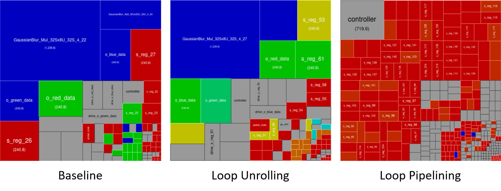
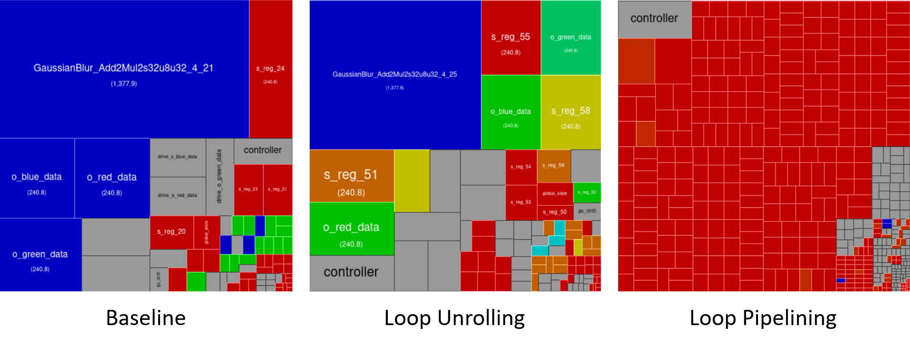

# Midterm Project - Edge Detection Filter

In this project we're going to synthesize the kernel function of the edge detection filter and annotate the timing back to the SCML platform to get a more accurate simulated time of the entire system.

## The Edge Detection Filter

Obviously, the purpose of edge detection filter is to detect the edges on a picture in all directions. To achieve this, the filter has to detect the four directions of the edges, including vertical, horizontal, 45 degree, and -45 degree. Thus, an edge detection filter is actually a combination of four filters as shown in the figure below.

  

To adapt the filter to the input image, convolution is used here as shown in the following figure.

  

## System Architecture

### HLS Platform

The system architecture of the HLS platform is shown in the figure below. Only the kernal block, edge detection filter, is synthesized. The inputs and outputs are fed and fetched in splited R, G, and B channels.

  

### SCML Platform

The system architecture of the SCML platform is shown in the figure below where a RAM and a SCML router are involved.

  

The figure below shows the dataflow of the platform. The input is fed into the `Testbench` and is sent to the computation kernal `Edge detection filter` through the SCML router. After the computation, the results are written to `RAM` again through the router and dump a output bitmap.

  

## Implemantation and Optimizations

### The Implementation of The Edge Detection Filter

-	The edge detection filter is defined in EdgeDetection.cpp:

		// Edge detection filter
		const int filter[filterHeight][filterWidth] =
		{
		  {-1, -1, -1},
		  {-1, 8, -1},
		  {-1, -1, -1}
		};

-	The edge detection filter kernal applies the filter to the input R, G, and B, and sends out the output:

		for (unsigned int v = 0; v<filterHeight; ++v) {
			for (unsigned int u = 0; u<filterWidth; ++u) {
				sc_dt::sc_uint<8> red_read;
				sc_dt::sc_uint<8> green_read;
				sc_dt::sc_uint<8> blue_read;
	    #ifndef NATIVE_SYSTEMC
					{
						HLS_DEFINE_PROTOCOL("input");
						red_read = i_r.get();
						green_read = i_g.get();
						blue_read = i_b.get();
						wait();
					}
	    #else
					red_read = i_r.read();
					green_read = i_g.read();
					blue_read = i_b.read();
	    #endif
					red += red_read * filter[v][u];
	        green += green_read * filter[v][u];
			    blue += blue_read * filter[v][u];
				}
			}
	    #ifndef NATIVE_SYSTEMC
			{
				HLS_DEFINE_PROTOCOL("output");
				o_red.put(red);
				o_green.put(green);
				o_blue.put(blue);
				wait();
			}
	    #else
	    o_red.write(red);
	    o_green.write(green);
	    o_blue.write(blue);
	    #endif

### The Optimizations on The Kernal

1.	Loop Unrolling:

	In this version of optimization, the inner for loop indexed by `u` below is unrolled by a factor of 3 in conservative mode. By doing so, the hardware for this part is trippled and run fully parallelly.

		for (unsigned int v = 0; v<filterHeight; ++v) {
			for (unsigned int u = 0; u<filterWidth; ++u) {
				sc_dt::sc_uint<8> red_read;
				sc_dt::sc_uint<8> green_read;
				sc_dt::sc_uint<8> blue_read;
		#ifndef NATIVE_SYSTEMC
				{
					HLS_DEFINE_PROTOCOL("input");
					red_read = i_r.get();
					green_read = i_g.get();
					blue_read = i_b.get();
					wait();
				}
		#else
				red_read = i_r.read();
				green_read = i_g.read();
				blue_read = i_b.read();
		#endif
				HLS_UNROLL_LOOP(CONSERVATIVE,3,"conv_loop");
				red += red_read * filter[v][u];
		        green += green_read * filter[v][u];
		        blue += blue_read * filter[v][u];
			}
		}

2.	Loop Pipelining:

	In this version of optimization, the nested for loops shown below is pipelined with the interval of 2 cycles. In this way, the critical path can be shorten, and thus the hardware can run faster. 

		HLS_PIPELINE_LOOP(HARD_STALL,2,"conv_loop_pipeline");
		for (unsigned int v = 0; v<filterHeight; ++v) {
			for (unsigned int u = 0; u<filterWidth; ++u) {
				sc_dt::sc_uint<8> red_read;
				sc_dt::sc_uint<8> green_read;
				sc_dt::sc_uint<8> blue_read;
		#ifndef NATIVE_SYSTEMC
				{
					HLS_DEFINE_PROTOCOL("input");
					red_read = i_r.get();
					green_read = i_g.get();
					blue_read = i_b.get();
					wait();
				}
		#else
				red_read = i_r.read();
				green_read = i_g.read();
				blue_read = i_b.read();
		#endif
				red += red_read * filter[v][u];
        green += green_read * filter[v][u];
        blue += blue_read * filter[v][u];
			}
		}

## How to execute the codes

-	First of all, go to the directory of each version.

		$ cd $Midterm/Baseline
		$ cd $Midterm/LoopUnrolling
		$ cd $Midterm/Looppipelining

-	Run behavioral simulation.

		$ make sim_B

-	Run synthesis and Verilog simulation with HLS configuration BASIC.

		$ make sim_V_BASIC

-	Run synthesis and Verilog simulation with HLS configuration DPA.

		$ make sim_V_DPA

## Results

-	Input and output bitmap result:

	
  

-	The synthesized results of simulated time lie in the table below:

	|                 | sim_B | sim_V_BASIC |  sim_V_DPA  |
	| -----------     | :------------: | ---------------: |  ---------------: |
	| Baseline  	  |    26214450 ns |      43909110 ns |       38010870 ns |
	| Loop Unrolling  |    26214450 ns |      36044790 ns |       30146550 ns |
	| Loop Pipelining |    26214450 ns |       2621990 ns |        1966620 ns |
	
-	And the table below shows the synthesized results of area:

	|                 | sim_V_BASIC |  sim_V_DPA  |
	| -----------     | ------: | --------: |
	| Baseline  	  |    3984 |      3420 |
	| Loop Unrolling  |    4571 |      4567 |
	| Loop Pipelining |    9174 |     16887 |

	According to the results above, the one with loop pipelining has the best performance in terms of speed. However, at the same time, it consume the most hardware resource.

-	The RTL analysis for BASIC configuration.

	
  

-	The RTL analysis for DPA configuration.

	
  

-	Finally, annotate the timing back to the SCML platform as follows:

		bool SobelFilter::ReadResult_r(uint &result_data_r) {
			result_reg_r = o_red.read();
			result_data_r = result_reg_r;

			return true;
		}

		bool SobelFilter::ReadResult_g(uint &result_data_g) {
			result_reg_g = o_green.read();
			result_data_g = result_reg_g;

			return true;
		}

		bool SobelFilter::ReadResult_b(uint &result_data_b) {
			result_reg_b = o_blue.read();
			result_data_b = result_reg_b;
			wait(1966620, SC_NS);
			return true;
		}

	And we finally get a more accurate simulated time of the entire system.

		Simulated time: 128885768212 ns

