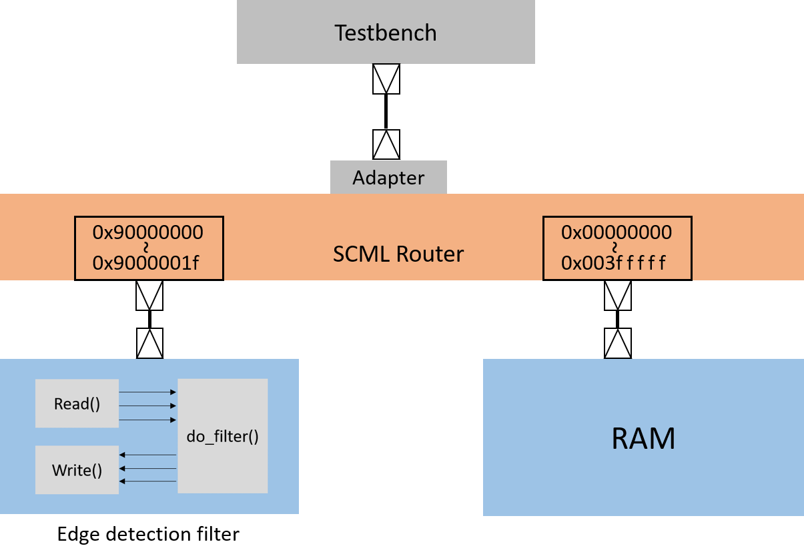

# Midterm Project - Edge Detection Filter

In this project we're going to synthesize the kernel function of the edge detection filter and annotate the timing back to the SCML platform to get a more accurate simulated time of the entire system.

## The Edge Detection Filter

Obviously, the purpose of edge detection filter is to detect the edges on a picture in all directions. To achieve this, the filter has to detect the four directions of the edges, including vertical, horizontal, 45 degree, and -45 degree. Thus, an edge detection filter is actually a combination of four filters as shown in the figure below.

To adapt the filter to the input image, convolution is used here as shown in the following figure.

## System Architecture

### HLS Platform

The system architecture of the HLS platform is shown in the figure below. Only the kernal block, edge detection filter, is synthesized. The inputs and outputs are fed and fetched in splited R, G, and B channels.

### SCML Platform

The system architecture of the SCML platform is shown in the figure below where a RAM and a SCML router are involved.

The figure below shows the dataflow of the platform. The input is fed into the `Testbench` and is sent to the computation kernal `Edge detection filter` through the SCML router. After the computation, the results are written to `RAM` again through the router and dump a output bitmap.

## Implemantation and Optimizations

1.	In the system.h:

		#ifndef NATIVE_SYSTEMC
			GaussianBlur_wrapper gaussian_blur;
		#else
			GaussianBlur gaussian_blur;
		#endif
			sc_clock clk;
			sc_signal<bool> rst;
		#ifndef NATIVE_SYSTEMC
			cynw_p2p< sc_dt::sc_uint<24> > rgb;
			cynw_p2p< sc_dt::sc_uint<32> > red;
			cynw_p2p< sc_dt::sc_uint<32> > green;
			cynw_p2p< sc_dt::sc_uint<32> > blue;
		#else
			sc_fifo< sc_dt::sc_uint<24> > rgb;
			sc_fifo< sc_dt::sc_uint<32> > red;
			sc_fifo< sc_dt::sc_uint<32> > green;
			sc_fifo< sc_dt::sc_uint<32> > blue;
		#endif

2.	In the Testbench.h:

		#ifndef NATIVE_SYSTEMC
			cynw_p2p< sc_dt::sc_uint<24> >::base_out o_rgb;
			cynw_p2p< sc_dt::sc_uint<32> >::base_in i_red;
			cynw_p2p< sc_dt::sc_uint<32> >::base_in i_green;
			cynw_p2p< sc_dt::sc_uint<32> >::base_in i_blue;
		#else
			sc_fifo_out< sc_dt::sc_uint<24> > o_rgb;
			sc_fifo_in< sc_dt::sc_uint<32> > i_red;
			sc_fifo_in< sc_dt::sc_uint<32> > i_green;
			sc_fifo_in< sc_dt::sc_uint<32> > i_blue;
		#endif

3.	In the GaussianBlur.cpp:

		#ifndef NATIVE_SYSTEMC
			cynw_p2p< sc_dt::sc_uint<24> >::in i_rgb;
			cynw_p2p< sc_dt::sc_uint<32> >::out o_red;
			cynw_p2p< sc_dt::sc_uint<32> >::out o_green;
			cynw_p2p< sc_dt::sc_uint<32> >::out o_blue;
		#else
			sc_fifo_in< sc_dt::sc_uint<24> > i_rgb;
			sc_fifo_out< sc_dt::sc_uint<32> > o_red;
			sc_fifo_out< sc_dt::sc_uint<32> > o_green;
			sc_fifo_out< sc_dt::sc_uint<32> > o_blue;
		#endif

4.	In the Testbench.cpp and GaussianBlur.cpp, the read() and write() functions are replaced with get() and put() functions. For example:

		#ifndef NATIVE_SYSTEMC
			o_rgb.put(rgb);
		#else
			o_rgb.write(rgb);
		#endif
		#ifndef NATIVE_SYSTEMC
			red = i_red.get();
		    green = i_green.get();
		    blue = i_blue.get();
		#else
			red = i_red.read();
		    green = i_green.read();
		    blue = i_blue.read();
		#endif

## How to execute the codes

-	First of all, go to the directory of each version.

		$ cd $Midterm/Baseline
		$ cd $Midterm/LoopUnrolling
		$ cd $Midterm/Looppipelining

-	Run behavioral simulation.

		$ make sim_B

-	Run synthesis and Verilog simulation with HLS configuration BASIC.

		$ make sim_V_BASIC

-	Run synthesis and Verilog simulation with HLS configuration DPA.

		$ make sim_V_DPA

## Results

-	Input and output bitmap result:

	

-	The synthesized results of simulated time lie in the table below:

	|                 | sim_B | sim_V_BASIC |  sim_V_DPA  |
	| -----------     | :------------: | ---------------: |  ---------------: |
	| Baseline  	  |    26214450 ns |      43909110 ns |       38010870 ns |
	| Loop Unrolling  |    26214450 ns |      36044790 ns |       30146550 ns |
	| Loop Pipelining |    26214450 ns |       2621990 ns |        1966620 ns |
	
-	And the table below shows the synthesized results of area:

	|                 | sim_V_BASIC |  sim_V_DPA  |
	| -----------     | ------: | --------: |
	| Baseline  	  |    3984 |      3420 |
	| Loop Unrolling  |    4571 |      4567 |
	| Loop Pipelining |    9174 |     16887 |

-	The RTL analysis for BASIC configuration.

	

-	The RTL analysis for DPA configuration.

	

-	Finally, annotate the timing back to the SCML platform as follows:

		Annotating timing

	And we'll get a more accurate simulated time of the entire system.

		Simulated time:

